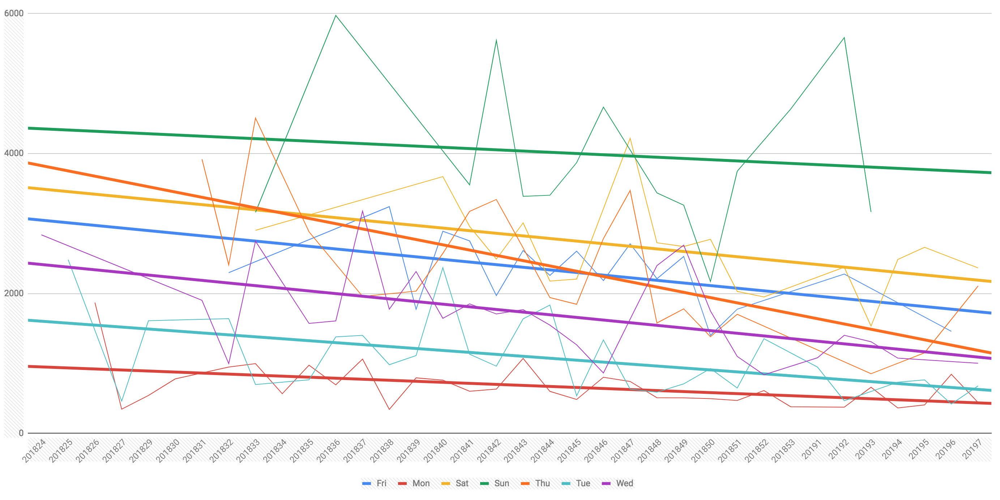

# NYT Crossword Stats

Fetch your NYT Crossword Puzzle solve stats and export them as CSV.

The NYT app shows minimal information around your streaks and average solve times. This gets you the raw data so you can do your own analysis.

## Requirements

1. Python
2. A NYT Crossword subscription

## Installation

1. Clone this repository
2. `pip install -r requirements.txt`

## Usage

Fetch all solve stats since January 1, 2019. Use your NYT email and passwords as arguments here
```bash
python fetch_puzzle_stats -u your@email.com -p yourpass -s 2019-01-01
```

The resulting CSV file (`data.csv` by default, override with `-o` flag) has your solve stats.

## Data Format

### Example CSV:
(my real stats...don't judge me you pros out there...)
```csv
date,day,elapsed_seconds,solved,checked,revealed
2019-02-14,Thu,2107,1,0,0
2019-02-15,Fri,2070,1,1,1
2019-02-16,Sat,2365,1,0,0
2019-02-17,Sun,0,0,0,0
```

date | day | elapsed_seconds | solved | checked | revealed
--- | --- | --- | --- | --- | ---
2019-02-14|Thu|2107|1|0|0
2019-02-15|Fri|2070|1|1|1
2019-02-16|Sat|2365|1|0|0
2019-02-17|Sun|0|0|0|0


### Fields in CSV:
* **date** - The date the puzzle was published
* **day** - The day the puzzle was published (e.g., "Mon", "Tue") - useful for comparing different difficulties
* **elapsed** - How long it took you to solve the puzzle, in seconds
* **solved** - `1` if you finished/solved the puzzle, `0` otherwise
* **checked** - `1` if you had to check an answer on the puzzle, thus making it ineligible for streaks
* **revealed** - `1` if you had to reveal an answer on the puzzle, thus making it ineligible for streaks

## Example

For an example of how to use this data, I plotted my solve times over the last ~8 months, grouped by day:

